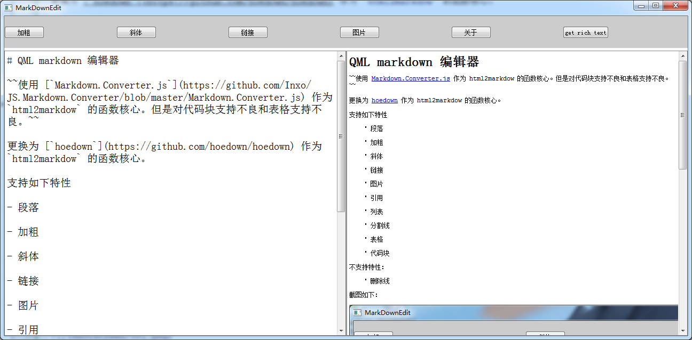

# >= Qt5.14 support Markdown

https://wiki.qt.io/New_Features_in_Qt_5.14

# QML markdown 编辑器

~~使用 [`Markdown.Converter.js`](https://github.com/Inxo/JS.Markdown.Converter/blob/master/Markdown.Converter.js) 作为 `html2markdow` 的函数核心。但是对代码块支持不良和表格支持不良。~~

更换为 [`hoedown`](https://github.com/hoedown/hoedown) 作为 `html2markdow` 的函数核心。

支持如下特性

- 段落

- 加粗

- 斜体

- 链接

- 图片

- 引用

- 列表

- 分割线

- 表格

- 代码块

不支持特性：

- 删除线

截图如下：

