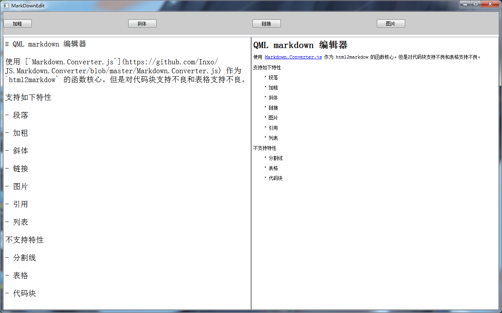

# QML markdown 编辑器

使用 [`Markdown.Converter.js`](https://github.com/Inxo/JS.Markdown.Converter/blob/master/Markdown.Converter.js) 作为 `html2markdow` 的函数核心。但是对代码块支持不良和表格支持不良。

支持如下特性

- 段落

- 加粗

- 斜体

- 链接

- 图片

- 引用

- 列表

不支持特性

- 分割线

- 表格

- 代码块

截图如下：

